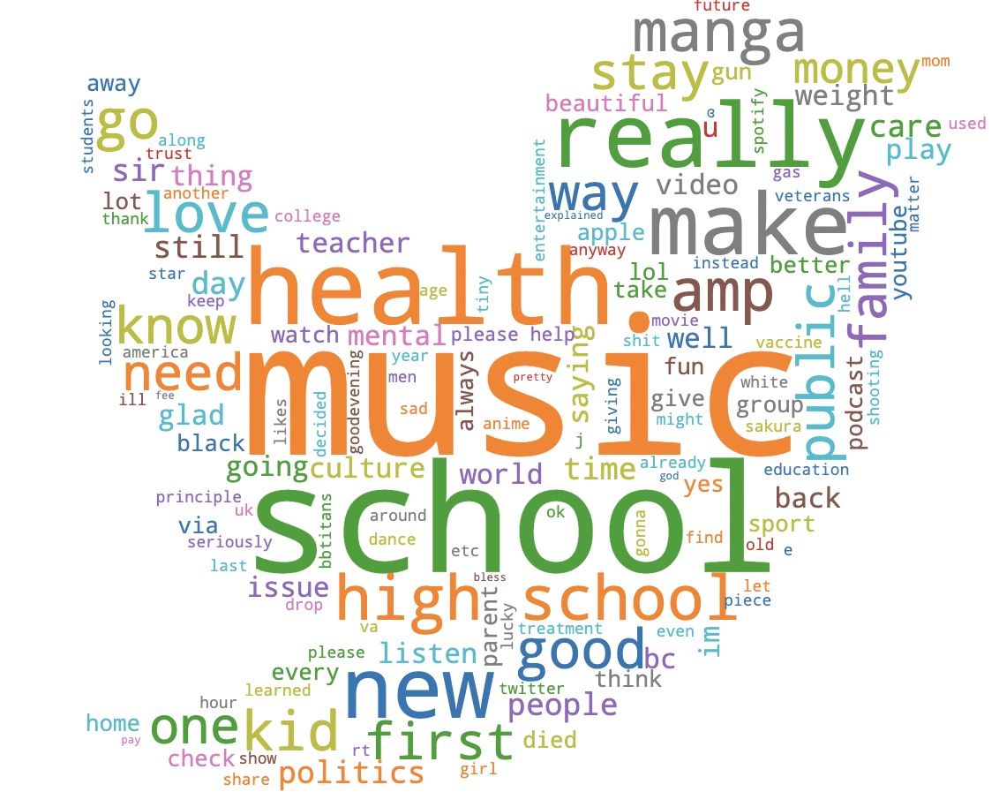
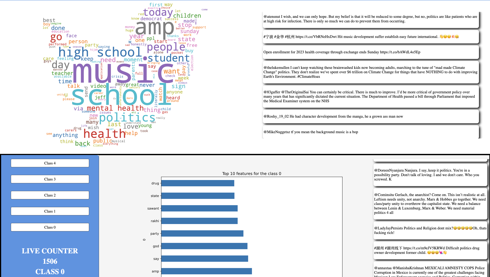

# Real-time Twitter Stream Visualization and classification

  

This project is a real-time Twitter stream visualization that uses the following technologies:
- Node.js
- Express
- EJS
- Socket.IO
- kafka-node
- Python

## Getting Started

These instructions will get you a copy of the project up and running on your local machine for development and testing purposes.

### Prerequisites

You need to have the following installed on your machine:
- Node.js
- Python3
- Kafka
- kafka-python
- wordcloud

### Installing

1. Clone the repository to your local machine
git clone https://github.com/zack242/Kafka-Twitter-NLP.git

2. Install the necessary Node.js packages

3. Install the necessary Python packages (pip install -r requirements.txt)

4. Make sure Kafka is running on your local machine

5. Start the Node.js server

6. Visit [http://localhost:3000](http://localhost:3000) to view the visualization in your browser.

## Usage

1. Connect to the server by visiting [http://localhost:3000](http://localhost:3000) in your browser.

  

## Built With

* [Node.js](https://nodejs.org/) - JavaScript runtime
* [Express](https://expressjs.com/) - Node.js web framework
* [EJS](https://ejs.co/) - Embedded JavaScript templating
* [Socket.IO](https://socket.io/) - Real-time, bidirectional and event-based communication
* [kafka-node](https://github.com/SOHU-Co/kafka-node) - A Node.js client for Apache Kafka
* [Python](https://www.python.org/) - Programming language
* [wordcloud](https://github.com/amueller/word_cloud) - A little word cloud generator in Python

## Contributing

Please read [CONTRIBUTING.md](https://gist.github.com/PurpleBooth/b24679402957c63ec426) for details on our code of conduct, and the process for submitting pull requests to us.

## Authors

* **Zakaria Tozy* - *ZT* - [Your Github](https://github.com/zack242)
* **Karine Zafy* - *ZY* - [Your Github](https://github.com/pailleaunez)
* **Marius* - *ZY* - [Your Github](https://github.com/zack242)

## License

This project is licensed under the MIT License - see the [LICENSE.md](LICENSE.md) file for details
